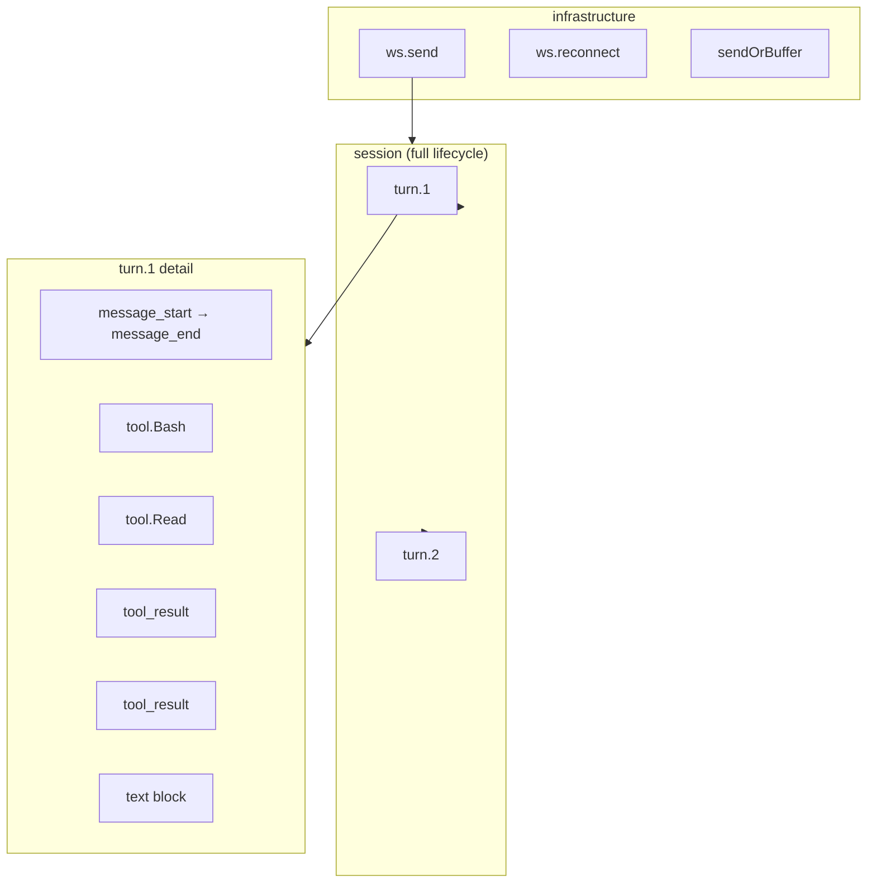

# Deep OTel Span Instrumentation

Add comprehensive OpenTelemetry spans across the Mitzo server — session lifecycle, query-loop turns, tool executions, and connection events — so Jaeger (and later MLflow) shows the full request flow from WS connect to session end.

## Current State

Only `server/ws-handler-v2.ts` has OTel spans (22 span calls across `ws.send`, `ws.reconnect`, `ws.switch_session`). The core paths — query-loop, tool execution, session lifecycle, connection management — have zero instrumentation. Jaeger shows WS handler entry points but nothing about what happens inside.

## Target Span Hierarchy

## Steps

### Step 1: Session-level span in query-loop

**File:** `server/query-loop.ts`

Wrap the entire `runQueryLoop` in a root span `session`. Attributes: `session.id`, `session.clientId`, `session.cwd`, `session.mode`. Set status to ERROR on catch, OK on normal completion. Record `session.duration_ms`, `session.num_turns`, `session.total_tokens` on end.

### Step 2: Per-turn spans

**File:** `server/query-loop.ts`

On each `message_start`, start a child span `turn` under the session span. End it on `message_end`. Track `turn.index`, `turn.message_id`, `turn.block_count`. This gives per-turn latency in Jaeger.

### Step 3: Tool execution spans

**File:** `server/query-loop.ts`

On `content_block_start` with `blockType === 'tool_use'`, start a child span `tool.<name>` under the current turn span. End it on the corresponding `tool_result`. Attributes: `tool.name`, `tool.id`, `tool.input` (summarized), `tool.is_error`, `tool.result_length`. This is where MLflow's GenAI conventions will shine later.

### Step 4: Token tracking spans

**File:** `server/query-loop.ts`

On `message_start` with usage data (parent agent context), record as span events on the turn span: `token.input`, `token.output`, `token.cache_read`, `token.cache_creation`, `token.context_total`. On `result`, record final cumulative usage on the session span.

### Step 5: Connection lifecycle spans

**File:** `server/index.ts`

Add spans for `handleChatWsV2` (connection open → close), with attributes: `ws.connectionId`, `ws.protocol_version`, `ws.close_code`, `ws.duration_ms`. This captures the WS connection lifecycle — key for diagnosing drops.

### Step 6: sendOrBuffer delivery span

**File:** `server/query-loop.ts`

Lightweight span or span event on `sendOrBuffer` — records whether delivery went v1 or v2 path, whether the session was attached/detached, and the event type. Useful for diagnosing "events sent but client didn't receive" issues.

### Step 7: Trace context in logs

Wire the logger to include `trace_id` and `span_id` from the active OTel context in every log line. This lets you click a log line in the server output and find the corresponding trace in Jaeger, and vice versa.

## Design Notes

- All spans use the existing `tracer` from `server/tracing.ts` — no-op when OTel is disabled
- Use `BatchSpanProcessor` instead of `SimpleSpanProcessor` for production (lower overhead)
- Span names follow OTel conventions: `session`, `turn`, `tool.<name>`, `ws.connect`
- Tool input is summarized (not raw) to avoid bloating trace storage
